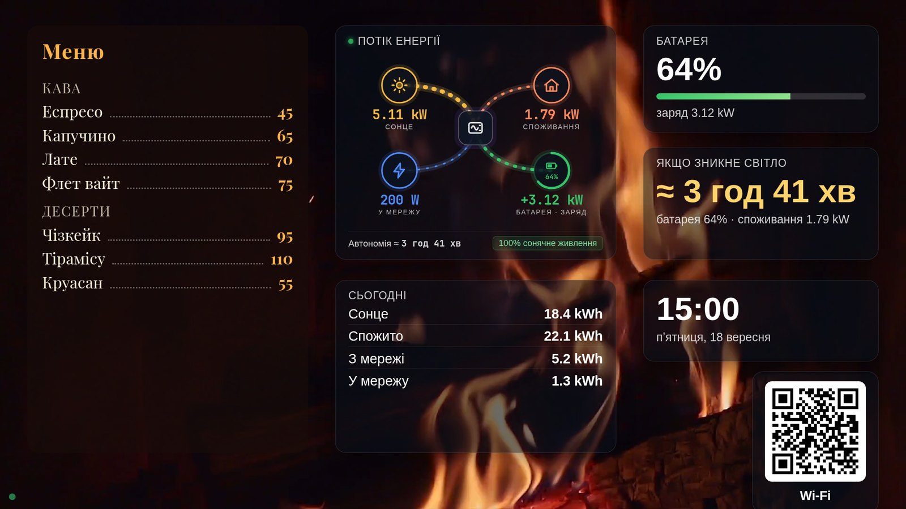
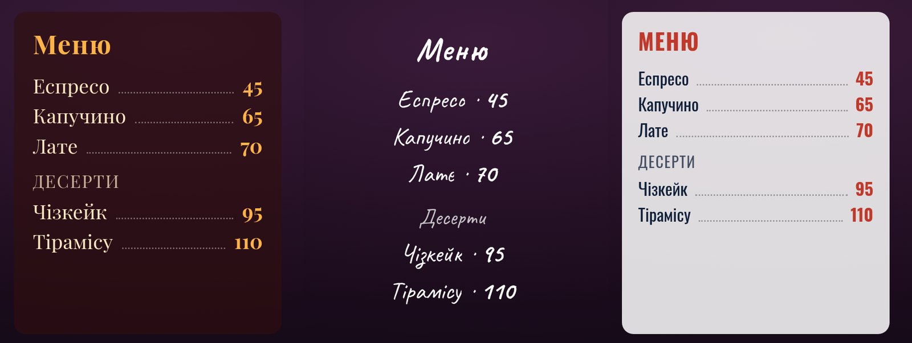
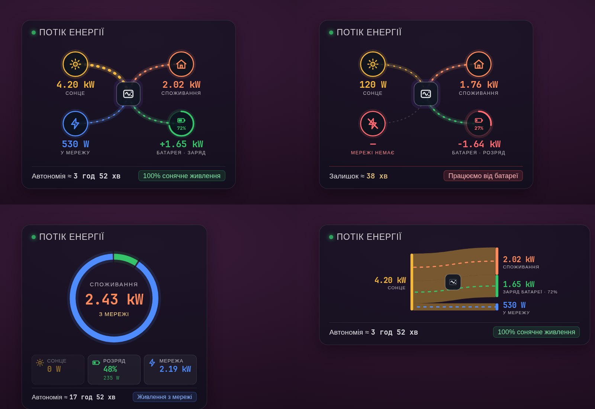
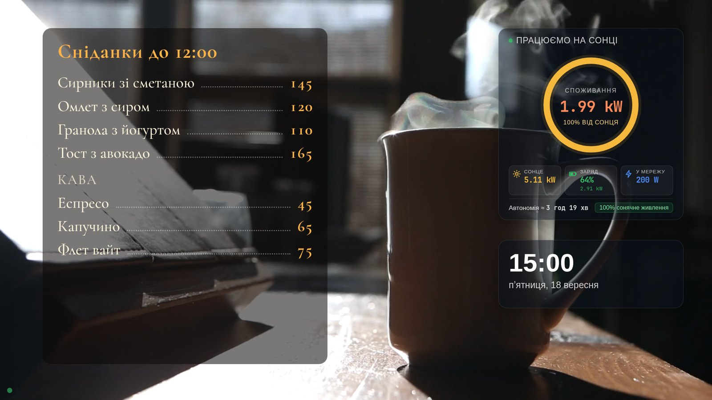
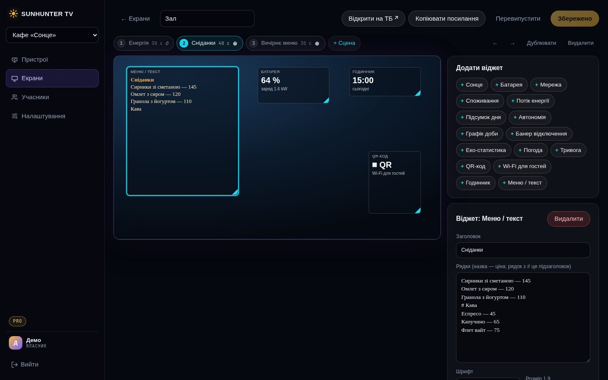
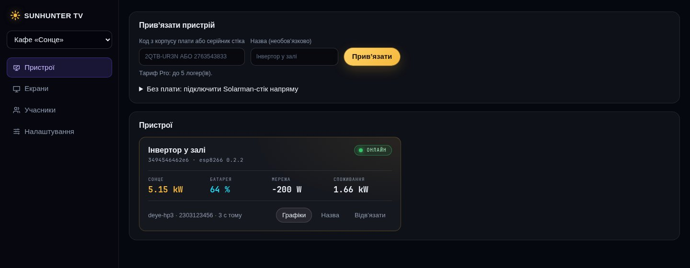
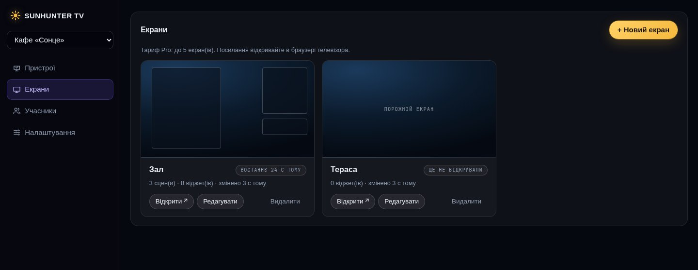
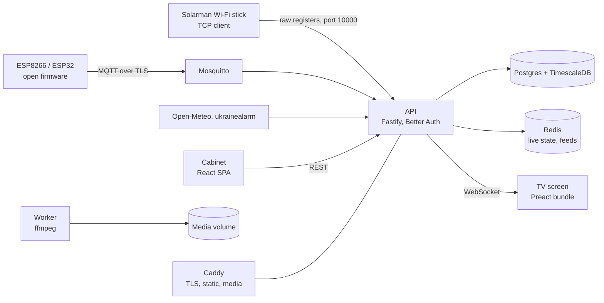
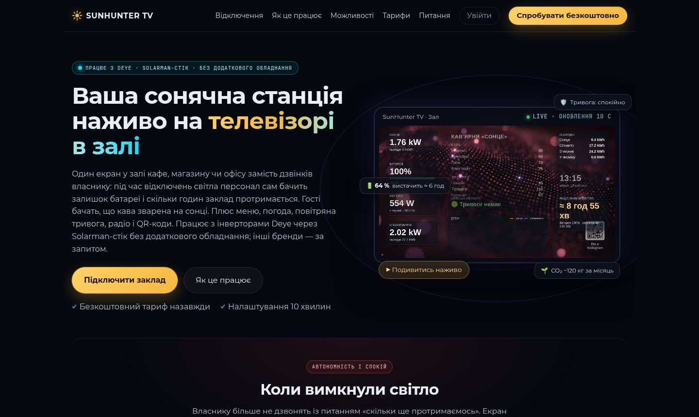

# SunHunter TV

**Digital menu boards and signage for cafés, shops and offices — on any Smart TV, with live solar-power widgets on top.**

[Website](https://tv.sun-hunter.men) · [Live demo screen](https://tv.sun-hunter.men/s/7ksxpmqDtpPBasCOB0xm-ydyqo1DvdywJZS2SSy-tN8) · [Українською](README.uk.md)



SunHunter TV turns the TV on your wall into a menu board. You build a screen in a web editor: a looping video or photo background, your menu with prices, a clock, QR codes, guest Wi-Fi, online radio. The TV opens one link in its built-in browser and stays in sync from then on.

If the venue runs on a Deye hybrid inverter, the same screen also shows the solar station live: generation, battery, grid, consumption, and during a blackout, how many hours the place can keep working.

## Free code, fair price

- **The code is open** under [AGPL-3.0](LICENSE). Clone the repository, run it on your own server, use every feature.
- **The hosted service has a free plan forever:** one TV and one inverter logger with the full feature set.
- **The paid plan is priced on purpose at no more than the VDS you would rent to self-host:** Pro is 600 UAH per month (about $15) for five TVs and five loggers.

If running your own server is not your idea of fun, the subscription costs the same as the server alone would, and we keep it updated, backed up and online.

| | Free | Pro | Max |
|---|---|---|---|
| TVs (screens) | 1 | 5 | 50 |
| Inverter loggers | 1 | 5 | 50 |
| All widgets, own video and photo backgrounds, radio, scenes | yes | yes | yes |
| History and charts | 1 year | 1 year | 2 years |
| Small SunHunter TV badge on screen | yes | no | no |
| Price | 0 | 600 UAH / month | on request |

## What you can put on the screen

**Signage**

- **Menu board**: sections, items and prices from plain text. Nine fonts with Cyrillic, font size, text, accent and card colours.
- **Scenes and schedule**: up to ten layouts per TV that rotate by timer or at random. A scene can be limited to certain hours, so breakfast shows until noon and the evening menu after five.
- **Backgrounds**: 30+ licensed looping clips (fireplace, waterfall, aquarium, rain, coffee) or your own video and photos.
- **QR codes**: a link, Instagram, reviews, or guest Wi-Fi that connects with one scan.
- **Online radio**: 14 Ukrainian stations, switched from the editor without touching the TV.
- **Clock, weather, and air-raid alert** for Ukrainian regions with a full-screen banner during an alert.

**Energy (Deye hybrid inverters)**

- **Live energy flow** in three styles: node diagram, source ring, and Sankey ribbons.
- **Battery, solar, grid and load** cards, daily totals, a day chart, monthly eco statistics.
- **Blackout mode**: a red banner the moment the grid drops, remaining battery and an estimate such as "about 3 h 20 min at the current load". A scene can be pinned for the duration of an outage, so staff see what matters without calling the owner.







## How it works

1. **Sign up** at [tv.sun-hunter.men](https://tv.sun-hunter.men) or start your own instance.
2. **Build the screen** in the editor: drag widgets on a 16:9 canvas, add scenes, pick a background. Changes reach the TV instantly.
3. **Open `tv.sun-hunter.men/tv` on the TV** and type the six-digit code from the editor. The TV remembers the screen, even after a power cut.
4. **Optional, for solar data:** point the inverter's Solarman Wi-Fi stick at the server (three fields on its hidden settings page). No extra hardware, and the Solarman app keeps working. An ESP8266/ESP32 board with open firmware is supported as an alternative path.

Any Smart TV with a browser works: Samsung, LG, Android TV, or a cheap TV stick. The TV bundle targets old TV browsers and weighs about 30 KB gzipped.







## Architecture



The device sends raw Modbus registers. All interpretation lives on the server in `packages/register-maps`, so new inverter models are added without touching hardware. Supported today: Deye single-phase SG0xLP1, three-phase low-voltage SG04LP3 and high-voltage SG01HP3.

| Path | What it is |
|---|---|
| `apps/api` | REST, WebSocket, auth, Solarman TCP server, MQTT ingest and broker ACL, billing, feeds |
| `apps/web` | Cabinet and landing page (Vite, React) |
| `apps/tv` | TV screen (Vite, Preact, ES2015 target) |
| `apps/worker` | ffmpeg queue: video to 1080p/720p, photos to JPEG, previews |
| `packages/shared` | zod schemas, scene rotation, energy-flow maths, shared types |
| `packages/register-maps` | Deye register maps and parser, tested on real dumps |
| `firmware` | PlatformIO firmware for ESP8266/ESP32 with signed OTA updates |
| `deploy` | Production compose file, Caddyfile, Mosquitto config, deploy script |
| `docs` | [Product spec](docs/SPEC.md), [open protocol](docs/PROTOCOL.md), [stage 1 plan and DB schema](docs/STAGE1.md) |

## Run it locally

Requires Node 24+ and pnpm. No Docker needed for UI work: the mock API runs on an in-memory Postgres with a demo venue, a live fake inverter and a screen.

```bash
pnpm install
pnpm --filter @deye/api dev:mock     # API on :3000, login demo@example.com / correct horse battery staple
pnpm --filter @deye/web dev          # cabinet on :5173
pnpm test                            # 127 tests: register maps on real dumps, API on PGlite
pnpm typecheck
```

For the full stack with Postgres + TimescaleDB, Redis and Mosquitto:

```bash
docker compose -f docker-compose.dev.yml up -d
pnpm db:migrate && pnpm db:seed
pnpm --filter @deye/api dev
```

## Self-hosting

A VDS with 2 vCPU and 2 GB RAM is enough. You need a domain pointing at the server and ports 80, 443, 8883 (MQTT over TLS for ESP boards) and 10000 (Solarman sticks) open.

```bash
git clone https://github.com/andreyyaremenko-ops/deye-dashboard.git
cd deye-dashboard/deploy
cp .env.example .env                 # set DOMAIN, POSTGRES_PASSWORD, BETTER_AUTH_SECRET, MQTT_INTERNAL_PASS
docker compose up -d
./deploy.sh migrate seed api worker static
```

`DOMAIN` in `.env` is the only place the host name lives: Caddy obtains a TLS certificate for it, the API uses it as its public URL, and the same certificate is handed to Mosquitto for MQTT over TLS. Server-specific extras (other sites behind the same Caddy, extra networks) go into `deploy/caddy-extra/*.caddy` and `deploy/docker-compose.override.yml`, both outside git. Details and operational notes are in [deploy/README.md](deploy/README.md).

## Tech stack

Fastify 5, Drizzle ORM, Postgres with TimescaleDB, Redis, Mosquitto with HTTP auth, Better Auth, zod 4, Vite, React, Preact, ffmpeg, Caddy, PlatformIO. TypeScript runs without a build step on Node 24.

## License

Copyright © 2026 SunHunter TV contributors. Licensed under the [GNU Affero General Public License v3.0](LICENSE): you may use, modify and self-host the code freely; if you run a modified version as a network service, you must make your changes available under the same license. Fonts in `apps/tv/public/fonts` are from Google Fonts under the SIL Open Font License.

## Links

- Website and hosted service: https://tv.sun-hunter.men
- Live demo screen: https://tv.sun-hunter.men/s/7ksxpmqDtpPBasCOB0xm-ydyqo1DvdywJZS2SSy-tN8
- Contact: onkofe227@gmail.com


