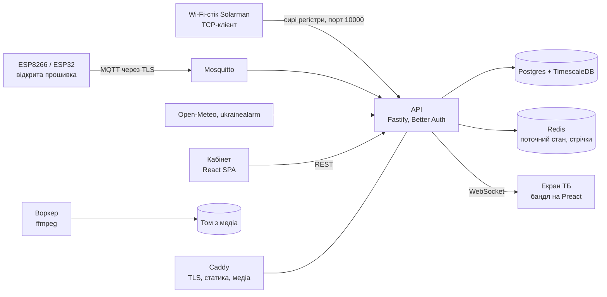

# SunHunter TV

**Електронне меню та digital signage для кафе, магазинів і офісів — на будь-якому Smart TV, з живими віджетами сонячної станції.**

[Сайт](https://tv.sun-hunter.men) · [Демо-екран наживо](https://tv.sun-hunter.men/s/7ksxpmqDtpPBasCOB0xm-ydyqo1DvdywJZS2SSy-tN8) · [English](README.md)


SunHunter TV перетворює телевізор на стіні закладу на меню-борд. Екран збирається у вебредакторі: відео або фото на фоні, меню з цінами, годинник, QR-коди, Wi-Fi для гостей, онлайн-радіо. Телевізор відкриває одне посилання у вбудованому браузері й далі оновлюється сам.

Якщо заклад працює від гібридного інвертора Deye, той самий екран показує сонячну станцію наживо: генерацію, батарею, мережу, споживання. А під час відключення світла ще й скільки годин заклад протримається.

## Код безкоштовний, ціна чесна

- **Код відкритий** за ліцензією [AGPL-3.0](LICENSE). Клонуйте репозиторій, запускайте на власному сервері, користуйтесь усім функціоналом.
- **У сервісі є безкоштовний тариф назавжди:** один телевізор і один логер інвертора з повним набором можливостей.
- **Платна підписка свідомо коштує не більше за оренду VDS, який знадобився б для власного сервера:** Pro — 600 ₴ на місяць за пʼять телевізорів і пʼять логерів.

Якщо адмініструвати сервер не хочеться, підписка коштує стільки ж, скільки сам сервер, а оновлення, резервні копії та доступність лишаються на нас.

| | Free | Pro | Max |
|---|---|---|---|
| Телевізорів (екранів) | 1 | 5 | 50 |
| Логерів інвертора | 1 | 5 | 50 |
| Усі віджети, власні відео й фото, радіо, сцени | так | так | так |
| Історія та графіки | 1 рік | 1 рік | 2 роки |
| Невеликий напис SunHunter TV на екрані | є | немає | немає |
| Ціна | 0 | 600 ₴ / місяць | за домовленістю |

## Що можна вивести на екран

**Меню та реклама**

- **Меню-борд**: розділи, позиції та ціни зі звичайного тексту. Девʼять шрифтів з кирилицею, розмір, кольори тексту, акценту і картки.
- **Сцени та розклад**: до десяти виглядів на один телевізор, що змінюються за таймером або випадково. Сцену можна обмежити годинами: сніданки до полудня, вечірнє меню після пʼятої.
- **Фони**: понад 30 ліцензійних зациклених відео (камін, водоспад, акваріум, дощ, кава) або власні відео й фото.
- **QR-коди**: посилання, Instagram, відгуки або гостьовий Wi-Fi, що підключається одним сканом.
- **Онлайн-радіо**: 14 українських станцій, перемикання з редактора без дотику до телевізора.
- **Годинник, погода і повітряна тривога** для областей України з банером на весь екран під час тривоги.

**Енергія (гібридні інвертори Deye)**

- **Потік енергії наживо** у трьох стилях: схема з вузлами, кільце джерел і стрічки Sankey.
- **Батарея, сонце, мережа, споживання**, підсумок дня, графік доби, місячна еко-статистика.
- **Режим відключення**: червоний банер, щойно зникла мережа, залишок батареї та прогноз на кшталт «вистачить ≈ 3 год 20 хв при поточному споживанні». Сцену можна закріпити на час відключення, і персонал бачить головне, не дзвонячи власнику.


## Як це працює

1. **Зареєструйтесь** на [tv.sun-hunter.men](https://tv.sun-hunter.men) або підніміть власний сервер.
2. **Зберіть екран** у редакторі: перетягуйте віджети на полотні 16:9, додавайте сцени, обирайте фон. Зміни зʼявляються на телевізорі одразу.
3. **Відкрийте на телевізорі `tv.sun-hunter.men/tv`** і введіть шестизначний код з редактора. Телевізор памʼятає екран навіть після вимкнення світла.
4. **За бажанням, для даних станції:** спрямуйте Wi-Fi-стік Solarman на сервер (три поля на його прихованій сторінці налаштувань). Додаткове обладнання не потрібне, застосунок Solarman працює як і раніше. Альтернативний шлях — плата ESP8266/ESP32 з відкритою прошивкою.

Підходить будь-який Smart TV з браузером: Samsung, LG, Android TV або недорога ТВ-приставка. Бандл екрана розрахований на старі ТВ-браузери й важить близько 30 КБ у gzip.


## Архітектура



Пристрій надсилає сирі регістри Modbus. Уся інтерпретація живе на сервері в `packages/register-maps`, тому нові моделі інверторів додаються без зміни заліза. Зараз підтримуються Deye: однофазні SG0xLP1, трифазні низьковольтні SG04LP3 і високовольтні SG01HP3.

| Шлях | Що це |
|---|---|
| `apps/api` | REST, WebSocket, авторизація, TCP-сервер для стіків Solarman, MQTT-інжест і ACL брокера, білінг, стрічки |
| `apps/web` | Кабінет і лендінг (Vite, React) |
| `apps/tv` | Екран для ТБ (Vite, Preact, ціль ES2015) |
| `apps/worker` | Черга ffmpeg: відео в 1080p/720p, фото в JPEG, превʼю |
| `packages/shared` | zod-схеми, ротація сцен, математика потоку енергії, спільні типи |
| `packages/register-maps` | Карти регістрів Deye і парсер, тести на реальних дампах |
| `firmware` | Прошивка PlatformIO для ESP8266/ESP32 з підписаними OTA-оновленнями |
| `deploy` | Продакшн compose, Caddyfile, конфіг Mosquitto, скрипт деплою |
| `docs` | [Специфікація продукту](docs/SPEC.md), [відкритий протокол](docs/PROTOCOL.md), [план етапу 1 і схема БД](docs/STAGE1.md) |

## Локальний запуск

Потрібні Node 24+ і pnpm. Для роботи над інтерфейсом Docker не потрібен: мок-API працює на Postgres у памʼяті з демо-закладом, «живим» інвертором і екраном.

```bash
pnpm install
pnpm --filter @deye/api dev:mock     # API на :3000, логін demo@example.com / correct horse battery staple
pnpm --filter @deye/web dev          # кабінет на :5173
pnpm test                            # 127 тестів: карти регістрів на реальних дампах, API на PGlite
pnpm typecheck
```

Повний стек з Postgres + TimescaleDB, Redis і Mosquitto:

```bash
docker compose -f docker-compose.dev.yml up -d
pnpm db:migrate && pnpm db:seed
pnpm --filter @deye/api dev
```

## Власний сервер

Достатньо VDS на 2 vCPU і 2 ГБ памʼяті. Потрібен домен, спрямований на сервер, і відкриті порти 80, 443, 8883 (MQTT через TLS для плат ESP) та 10000 (стіки Solarman).

```bash
git clone https://github.com/andreyyaremenko-ops/deye-dashboard.git
cd deye-dashboard/deploy
cp .env.example .env                 # задайте DOMAIN, POSTGRES_PASSWORD, BETTER_AUTH_SECRET, MQTT_INTERNAL_PASS
docker compose up -d
./deploy.sh migrate seed api worker static
```

Домен задається в одному місці — `DOMAIN` у `.env`: Caddy отримує на нього сертифікат TLS, API використовує його як публічну адресу, і той самий сертифікат передається Mosquitto для MQTT через TLS. Речі, специфічні для конкретного сервера (інші сайти за тим самим Caddy, додаткові мережі), кладуться в `deploy/caddy-extra/*.caddy` і `deploy/docker-compose.override.yml`, обидва поза git. Подробиці та експлуатаційні нотатки — у [deploy/README.md](deploy/README.md).

## Стек

Fastify 5, Drizzle ORM, Postgres з TimescaleDB, Redis, Mosquitto з HTTP-авторизацією, Better Auth, zod 4, Vite, React, Preact, ffmpeg, Caddy, PlatformIO. TypeScript виконується без збірки на Node 24.

## Ліцензія

Copyright © 2026 учасники проєкту SunHunter TV. Ліцензія [GNU Affero General Public License v3.0](LICENSE): код можна вільно використовувати, змінювати й розгортати в себе; якщо ви запускаєте змінену версію як мережевий сервіс, зміни мають бути відкриті під тією ж ліцензією. Шрифти в `apps/tv/public/fonts` — з Google Fonts за ліцензією SIL Open Font License.

## Посилання

- Сайт і хмарний сервіс: https://tv.sun-hunter.men
- Демо-екран наживо: https://tv.sun-hunter.men/s/7ksxpmqDtpPBasCOB0xm-ydyqo1DvdywJZS2SSy-tN8
- Контакт: onkofe227@gmail.com


